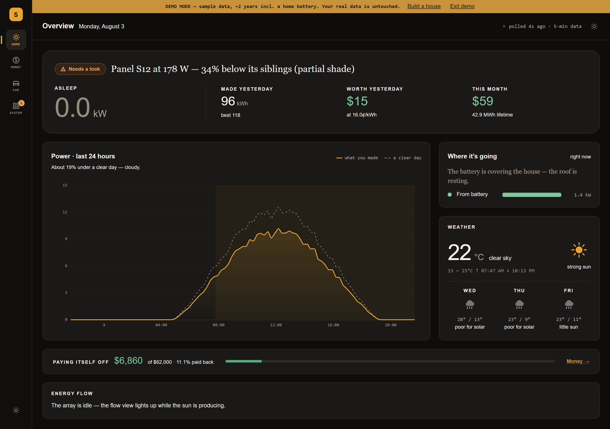
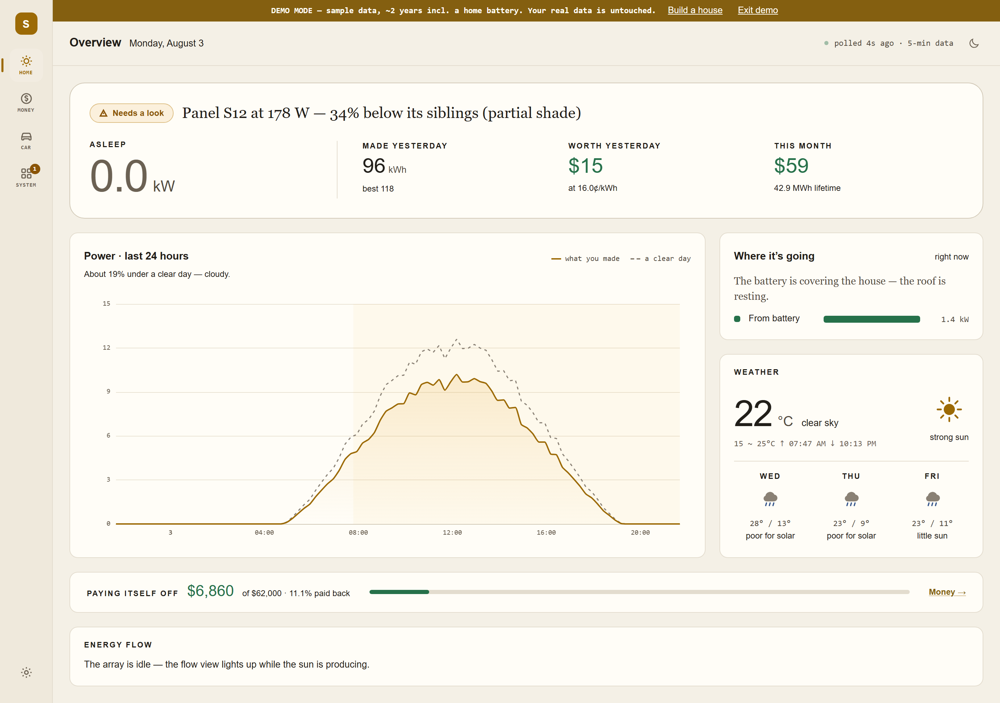
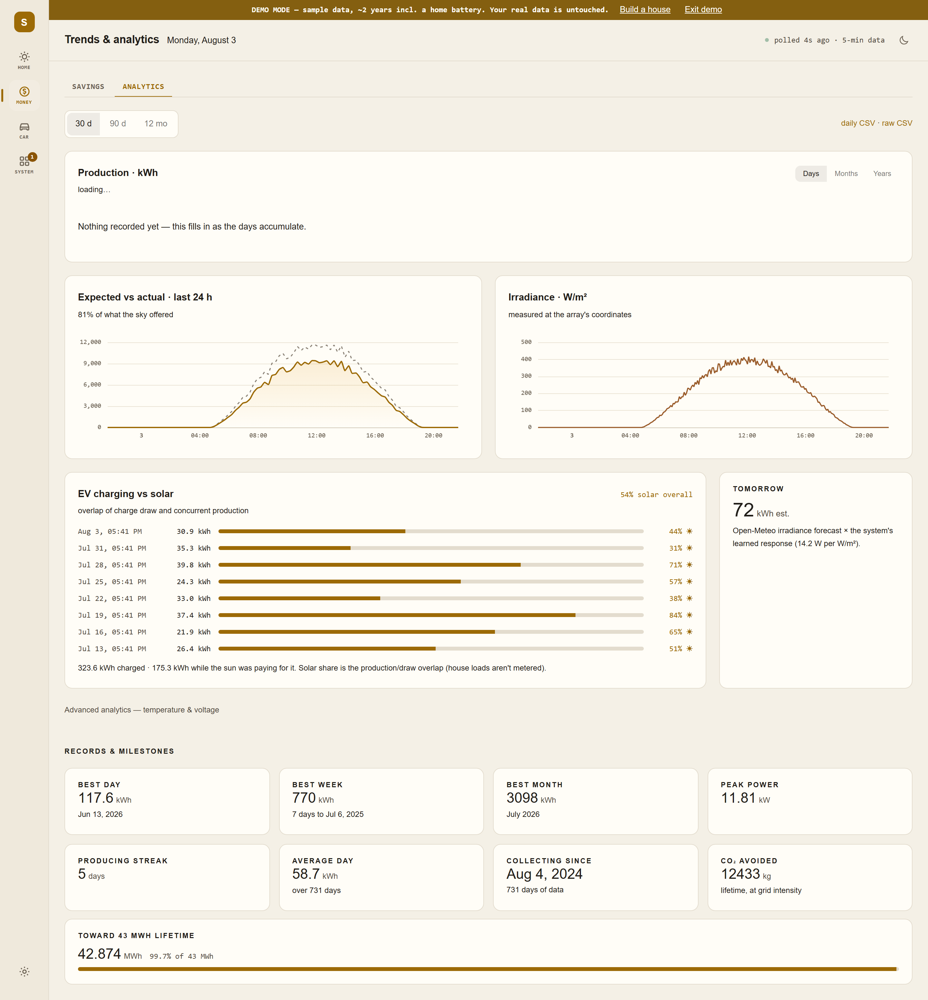
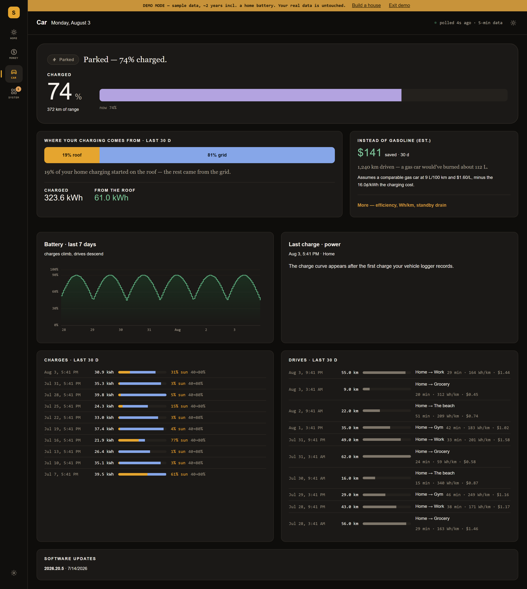

# Solar Dashboard

### A home energy dashboard that would rather tell you nothing than tell you something false.

Self-hosted, local-first monitoring for solar, storage, EV charging and the devices
around them. It scans your network, adopts what it finds, and turns it into one picture
of what the roof made, where it went, and what it was worth.

The unusual part is what it refuses to do.

Most dashboards will happily draw you a bar. Ask one for production *this month* when
the month is three days old, and it will put a short bar beside last month's tall one
and let you conclude something has gone wrong. Ask where your car is and it will tell
you, whether or not it knows.

This one marks the three-day bar as a part-period and says *"no complete months yet"*.
It says **"Parked"** rather than **"Parked in the garage"** until someone tells it where
the garage is. When a charger stops answering, it says so — rather than leaving three
days of frozen figures on screen, looking like a quiet week.

Everything runs on your hardware. No vendor account, no cloud round-trip, no telemetry
leaving the house. Where a device is cloud-only, that is documented as a limitation
rather than papered over.



<table>
<tr>
<td width="50%"></td>
<td width="50%"></td>
</tr>
<tr>
<td><em>Both themes are authored and contrast-checked in CI — not one inverted into the other.</em></td>
<td><em>Part-periods are drawn hollow, because a three-day month is not a short month.</em></td>
</tr>
</table>



*Every charge against what the roof was making at that minute, and where the car was.
"Home" rather than your own street address, repeated down the page.*

> Screenshots use the built-in demo dataset, and the banner across the top says so — which
> is the same rule the rest of the app follows. Turn it on yourself with **Settings → Demo
> mode**.

---

## Why another one of these

There are good self-hosted solar dashboards — [SOLECTRUS][solectrus], Home Assistant's
energy dashboard, [OpenDTU][opendtu] and [AhoyDTU][ahoy] for Hoymiles hardware,
[evcc][evcc] for solar-aware charging. If you want the deepest EV charge *control*, use
evcc. If you want the widest integration surface, use Home Assistant.

Three things here are hard to find elsewhere.

**Uncertainty is a first-class value.** A figure the app cannot justify is not shown.
`null` means *nobody told us* and never quietly becomes `0`. Part-periods are drawn as
part-periods. Every screen separates "this is zero" from "we do not know" — because they
look identical, and only one of them is a problem.

**It knows what plan you are on, and monitors it.** ([guide](guide/plans.md)) Most
dashboards multiply production by one price, which is the right answer for roughly nobody.
Pick net metering, a feed-in tariff, time-of-use or no-export credit and every dollar
figure is recomputed by that plan's own rules — there is no hardcoded tariff anywhere.

Under Canadian net metering that means credits banking 1:1 and expiring on 31 March, sales
tax applying to what you buy back but not to what you export — so a kilowatt-hour you use
yourself is worth about 15% more than one you sell, every day. It also means the app
watches the **expiry date**: it counts your bank forward from your own meter readings and
says what is on track to be forfeited and what extra draw would absorb it, in kWh a day and
in hours of charging at your charger's measured rate. Advisory, never automatic — and it
declines to guess without a balance rather than inventing one.

**It installs like an appliance.** A single signed binary and a systemd unit. Updates
verify a minisign signature, install, health-check the new build against the commit it
just wrote, and roll themselves back if it does not answer. Not a Compose file and a
Grafana you maintain forever.

[solectrus]: https://github.com/solectrus/solectrus
[opendtu]: https://github.com/tbnobody/OpenDTU
[ahoy]: https://github.com/lumapu/ahoy
[evcc]: https://evcc.io

---

## What it talks to

| | |
|---|---|
| **Solar** | Hoymiles DTU (local protobuf, no cloud), Fronius, OpenDTU, **SunSpec over Modbus TCP** |
| **Devices** | Shelly (Gen1 + Gen2+), Kasa, Tasmota, ESPHome, HomeKit/HAP, Mysa, **Daikin** |
| **Found, not yet readable** | **Tuya** — seen on the network, but local control needs a key only Tuya's cloud issues |
| **EV** | Tesla Wall Connector (local API); vehicle data via the optional TeslaMate |
| **Weather** | Open-Meteo forecast + irradiance, for expected-vs-actual |

**SunSpec is the multiplier.** Fronius, SMA, SolarEdge, Delta and ABB all implement the
same register map, so one adapter covers inverters we could never test individually.

**ESPHome is the escape hatch.** Anything you can bridge onto an ESP32 — a mini split's
CN105 port, a Modbus meter, a bare GPIO — arrives here as an ordinary metered device.

**Daikin is the rare one that measures itself.** Most heat pumps report no energy at
all; Daikin's legacy Wi-Fi adaptors publish real daily kWh. For everything else, declare
what a plug runs and its energy is estimated from on-time — with the confidence that
load type earns, so a heater's figure and a variable-speed pump's are never presented as
equally solid.

The scan reports **what it looked for**, not just what it found — so "no Tuya devices
here" can be told apart from "we never checked".

---

## Quick start

```bash
git clone <this-repo> solar-dashboard
cd solar-dashboard
cp .env.example .env
docker compose up -d --build
```

Open **http://localhost:8080** and follow the onboarding wizard: enter your subnet
(e.g. `192.168.1`), scan, and adopt what it finds. Configuration lives in the app, not
in env files.

No hardware yet? **Settings → Demo mode** loads about two years of generated data.

### Before first start

One value is mandatory, and only if you want the TeslaMate vehicle logger:

```bash
openssl rand -base64 24    # put the result in .env as TESLAMATE_ENCRYPTION_KEY
```

It encrypts your Tesla API tokens at rest. There is deliberately no default — a shipped
default would be a key every install shares. Compose refuses to start without it. Don't
lose it; changing it later means re-authenticating TeslaMate.

No Tesla? Comment out the `teslamate` service in `docker-compose.yml` and skip this.

### Poll interval — don't lower it

**Keep `POLL_INTERVAL_MS` at 300000 (5 minutes) on a Hoymiles DTU.** Polling every 30 s
starves the DTU's own cloud uplink — its firmware handles one connection at a time. This
is observed behaviour, not a guess.

---

## What it shows you

- **One answer per screen, in a sentence** — "Your roof is powering the house", "Parked
  at home since 3:51 PM" — before any number.
- **Production by day, month or year**, with part-periods drawn hollow so a three-day
  August is never compared to a full July by height.
- **Expected vs actual**, from forecast irradiance times *your* array's learned
  response — not its nameplate.
- **What charging actually cost**, and how much came off the roof, computed minute by
  minute from the overlap of car draw and production. Drawing 11 kW while the roof makes
  3 kW is 3 kW of sunshine and 8 kW of grid, in the same minute.
- **Your plan, monitored** ([guide](guide/plans.md)) — banked credits counted forward from
  your own meter readings, the date they are forfeited, what is on track to be lost, and
  what one more kilowatt-hour is worth used versus exported under *your* tariff. It refuses
  to project without a balance to anchor to, and reports energy the meter never counted
  separately rather than quietly adding it.
- **Alerts when a source goes quiet**, which is the failure that otherwise looks exactly
  like a calm afternoon.
- **Light and dark themes**, each authored and contrast-checked in CI rather than one
  inverted into the other.
- **An [MCP server](guide/mcp.md)** so you can ask an AI assistant about your own array —
  read-only, and it carries measured-vs-estimated and kept-vs-forgone into every answer
  rather than flattening them into a confident number.

---

## Guides

| | |
|---|---|
| [**Raspberry Pi**](guide/raspberry-pi.md) | Storage choices, a full install, moving an existing one across, TeslaMate, automatic updates, and the failures worth meeting on paper first |
| [**Your plan**](guide/plans.md) | The four tariffs, why self-use beats export, banked credits and the expiry date they vanish on |
| [**Configuration**](guide/configuration.md) | Environment variables and the HTTP endpoints |
| [**Backups**](guide/backups.md) | Where a backup can go, restoring one, filling a collection gap |
| [**Ask an AI about it**](guide/mcp.md) | The bundled MCP server — read-only, no dependencies, works with Claude Desktop and Claude Code |
| [**Development**](guide/development.md) | Running from source, the test suites, architecture |

Also: [CONTRIBUTING](CONTRIBUTING.md) · [SECURITY](SECURITY.md) ·
[CHANGELOG](CHANGELOG.md)

---

## Why a Raspberry Pi

Because this runs 24/7 forever, so idle draw is most of its lifetime cost.

| Host | Typical draw | Per year @ 16¢/kWh |
|---|---|---|
| Raspberry Pi 5 | ~6 W | **~$8** |
| Mini PC (N100) | ~12 W | ~$17 |
| Desktop tower | ~60 W | ~$84 |

Roughly **$75/yr** against a desktop — most of the cost of the Pi in year one.
*Typical figures, not measured on this workload.*

The honest exception: if the machine is already on for other reasons, the marginal
saving is zero. The saving is real only when the host exists solely to run this.

Full walkthrough in the [Raspberry Pi guide](guide/raspberry-pi.md) — including why
**not** to run it from an SD card.

---

## Status

Early. It runs 24/7 against a real rooftop array, an EV and a house full of devices, and
that install is where most of the bugs come from. Built first against Hoymiles hardware
and deliberately generalised outward — if it does not fit your setup, that is a gap
worth reporting rather than an intended limit.

AGPL-3.0-or-later. See [LICENSE](LICENSE).
